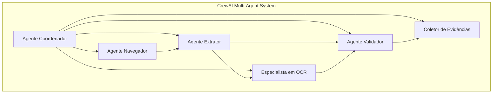

# DataHawk: Arquitetura e Fluxo de Dados

## 1. Arquitetura de Múltiplos Agentes (CrewAI)

O DataHawk é construído sobre uma arquitetura de múltiplos agentes, orquestrada pela estrutura CrewAI. Essa abordagem permite a especialização de tarefas, onde cada agente é responsável por uma parte específica do processo de validação. A colaboração entre os agentes resulta em um sistema mais robusto, escalável e de fácil manutenção.

O sistema é composto pelos seguintes seis agentes:

-   **Agente Navegador (Navigator Agent)**: Responsável por toda a interação com o navegador. Ele navega para as URLs de destino, realiza a interpolação de dados do CSV na URL e prepara a página para a extração de dados.
-   **Agente Extrator (Extractor Agent)**: Especializado na extração de dados da página web. Ele utiliza seletores de DOM para coletar informações diretamente da estrutura da página.
-   **Especialista em OCR (OCR Specialist)**: Entra em ação quando a extração de DOM não é suficiente. Ele captura screenshots de elementos específicos e utiliza o Tesseract.js para extrair texto de imagens.
-   **Agente Validador (Validator Agent)**: O cérebro da operação. Ele recebe os dados extraídos (tanto do DOM quanto do OCR) e os compara com os dados do arquivo CSV. Utilizando o LLM local (Llama-3), ele toma a decisão final sobre a validade dos dados.
-   **Coletor de Evidências (Evidence Collector)**: Responsável por registrar todo o processo. Ele coleta screenshots, snapshots do DOM, logs de validação e outras informações relevantes para auditoria.
-   **Agente Coordenador (Coordinator Agent)**: O maestro da orquestra. Ele gerencia o fluxo de trabalho, distribui tarefas para os outros agentes, monitora a saúde do sistema e garante que o processo de validação ocorra sem problemas.

### Diagrama da Arquitetura de Agentes



## 2. Fluxo de Dados de Validação

O processo de validação de dados no DataHawk segue um pipeline bem definido, desde o carregamento dos dados de entrada até a geração dos relatórios finais.

1.  **Entrada de Dados**: O processo começa com um arquivo CSV contendo os dados a serem validados e um arquivo de configuração YAML que define as regras de validação e o mapeamento de campos.
2.  **Carregamento e Configuração**: O `CSVLoader` carrega e analisa o arquivo CSV, enquanto o `ConfigManager` processa o arquivo de configuração, validando os esquemas e interpolando as variáveis de ambiente.
3.  **Navegação no Navegador**: O Agente Navegador utiliza o Playwright para abrir uma instância do navegador e navegar até a URL de destino, que pode ser um template preenchido com dados do CSV (por exemplo, `https://example.com/products/{product_id}`).
4.  **Extração Multi-Modal**:
    *   O Agente Extrator tenta extrair os dados diretamente do DOM usando os seletores definidos no arquivo de configuração.
    *   Se a extração do DOM falhar ou se a estratégia de validação for "híbrida", o Especialista em OCR é acionado para extrair texto de imagens.
5.  **Validação com LLM**: O Agente Validador recebe os dados extraídos e os compara com os valores esperados do arquivo CSV. Ele envia um prompt otimizado para o Llama-3, que retorna uma decisão de validação juntamente com uma pontuação de confiança.
6.  **Coleta de Evidências**: Durante todo o processo, o Coletor de Evidências captura screenshots, snapshots do DOM e logs detalhados, criando um registro completo de cada etapa da validação.
7.  **Geração de Relatórios**: Após o processamento de todas as linhas do CSV, o `ReportGenerator` compila os resultados e as evidências coletadas para gerar relatórios em múltiplos formatos (JSON, HTML, Markdown e CSV).

### Diagrama do Fluxo de Dados

```mermaid
graph LR
    subgraph "Input"
        A[Arquivo CSV]
        B[Configuração YAML]
    end

    subgraph "Processamento"
        C[Carregamento e Configuração]
        D[Navegação no Navegador]
        E[Extração Multi-Modal]
        F[Validação com LLM]
        G[Coleta de Evidências]
    end

    subgraph "Output"
        H[Relatórios (JSON, HTML, etc.)]
    end

    A --> C
    B --> C
    C --> D
    D --> E
    E --> F
    F --> G
    G --> H
```

## 3. Pilha de Tecnologia

O DataHawk utiliza um conjunto de tecnologias modernas e robustas para garantir sua eficiência e confiabilidade:

-   **TypeScript**: Garante a segurança de tipos em todo o projeto, reduzindo a probabilidade de erros em tempo de execução.
-   **Playwright**: Para uma automação de navegador confiável e robusta, com suporte a múltiplos navegadores.
-   **Tesseract.js**: Biblioteca de OCR para extração de texto de imagens diretamente no ambiente Node.js.
-   **Llama-3 8B**: Modelo de linguagem de última geração, executado localmente para garantir a privacidade e a operação offline.
-   **CrewAI**: Framework para a orquestração de sistemas de múltiplos agentes autônomos.
-   **Winston**: Para a geração de logs estruturados e detalhados.
-   **Zod**: Para a validação de esquemas de configuração, garantindo que os arquivos de configuração estejam sempre corretos.
-   **Jest**: Framework de testes para garantir a qualidade e a estabilidade do código. 